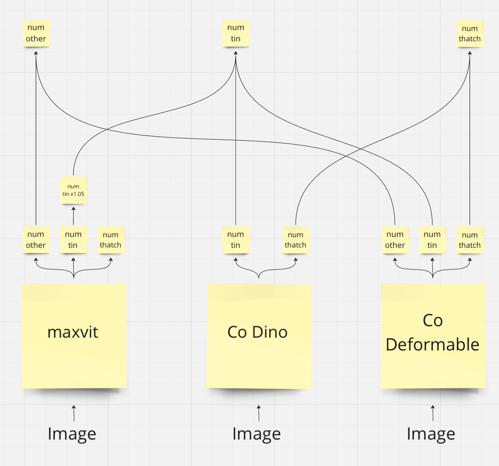

# First Place malawi solution

There are 2 parts of the solution - Regression in `part_panshin` and Object Detection in `part_sheoran`. 

Note that these parts require different cuda versions, drivers, GPU architectures, etc. All the specifications are listed in the corresponding dirs (`part_panshin` and `part_sheoran`).

In case of any issues, simply reach out at ivan.panshin@protonmail.com and I will solve all the issues for you.

## Reproduce inference
1. Create submission by Regression model. Look at `part_panshin/README.md/Install` and `part_panshin/README.md/Reproduce inference`.
2. Create submission by Object Detection model. Look at `part_sheoran/README.md/Install` and `part_sheoran/README.md/Reproduce inference`
3. Combine submissions to generate the 1st place sub. 
```
python create_final_sub.py
```
Submission will be saved at `final_subs/first_place_sub.csv`. This submission should give the following scores:
- Public: 0.2611
- Private: 0.2688

Which is 1st private place.

## Reproduce training 
1. Train Regression model. Look at `part_panshin/README.md/Install` and `part_panshin/README.md/Reproduce Training`.
2. Train Object Detection model. Look at `part_sheoran/README.md/Install` and `part_sheoran/README.md/Reproduce Training`.

## Documentation

1. Overview and objectives

The main idea is to combine a pure Regression model (that predict number of houses directly) and Object Detection models (that actually predict houses bboxes)

2. Architecture diagram


3. ETL process

- Split data into folds according to Stratification and Grouping. For Regression, Stratification is done based on number of bboxes on images. Grouping is done based on image_ids. For Object Detection, Stratification is done based on empty/non-empty images. Grouping is done based on image_ids.
- In order to load images, use CV2. In order to augment them, use Albumentations.

4. Data modeling
- Regression part uses `maxvit_base_tf_512.in21k_ft_in1k` from timm library. It's a powerful transformer that is very suitable for counting objects due to its global context.
- Object detection part uses `Co-Dino with Swin-Large` from mmdet and `Co-Deformable DETR with Swin-Base` from mmdet.
- Both models are optimized using MAE as loss, AdamW as optimizer.
- Regression model uses CosineAnnealing as scheduler, and Object Detection - StepLR. In both cases we decrease the original LR by 10 times. 
- Regression model is trained for 600 epochs, Object Detection models - 16 and 36.
- For augmentations we use Flips, Rotate, BrightnessContact and CoarseDropout.
- To evaluate regression performance, MAE is calculated on validation set. The regression model achieves 0.282 MAE.
- To evaluate Object Detection performance, mean average prevision at 0.5 is calculated on validation set. The models have roughly 0.9 AP@0.5
- Regression normalization is done by max value of image format. In this case, divide by 255.
- Object Detection normalization is done by mean-std based on ImageNet values. 
- Regression uses EMA to increase training metrics stability and bfloat16 to increase numerical stability during training.
- Fix the seeds at `part_panshin/reg_malawi/helpers/model_helpers/seed_everything`

5. Inference

- To inference the regression model on new data, create a new `.csv` file similar to `data/annotations/test.csv` that contains base names of files in `data/Images`. Then specify path to that `.csv` in `configs/dataset/test/test.csv` at `ann_path`. The predictions will be saved at the path specified at `configs/trainer/test.yaml`.
- When it comes to re-training, we recommend training from scratch, since it's easier in terms of setting up LRs for each re-training.

6. Run time

- The regression training takes about 7 hours on 4 x A6000 Ada.
- The regression inference takes about 1 minute on 1 x A6000 Ada.

- The Object Detection training takes about 10 hours on 4 x RTX 3090. 
- The Object Detection inference takes about 20 minutes on 1 x RTX 3090. 
